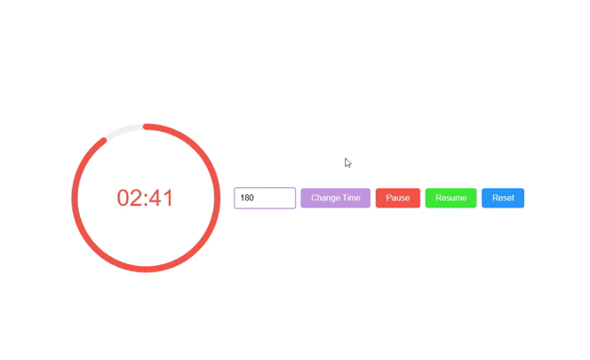

# CountdownTimer

A lightweight, customizable circular countdown timer for web applications.

## Demo

[](https://codepen.io/jeffoliveira977/pen/mydVvqo)



## Installation

To use the CountdownTimer, you need to include both the JavaScript and the CSS file in your HTML.

```html
<link rel="stylesheet" href="circular-countdown-js/countdown-timer.css">
<script src="circular-countdown-js/countdown-timer.js"></script>
```

## How to Use

1. Add an HTML element where the timer will be rendered:

```html
<div id="my-countdown"></div>
```

2. Create an instance of the CountdownTimer class in your JavaScript, passing the element selector and an options object (optional):

```javascript
const timer = new CountdownTimer('#my-countdown', {
  duration: 120, // Duration in seconds (default: 60)
  color: '#ff6b6b', // Color of the progress circle (default: #c39fe0)
  size: 150, // Size of the timer in pixels (default: 200)
  backgroundColor: '#f0f0f0', // Background color of the circle (default: #eee)
  strokeWidth: 8, // Stroke width of the circle in pixels (default: 4)
  fontSize: 0.25, // Font size of the text relative to the timer size (default: 0.2)
  onComplete: () => {
    console.log('Countdown finished!');
  },
  onTick: (timeLeft) => {
    // Do something every second, for example, update another element
    console.log('Time left:', timeLeft);
  }
});
```

## API Reference

### Constructor

```javascript
new CountdownTimer(selector, options)
```

- `selector`: String or HTMLElement - The CSS selector or DOM element where the timer will be rendered
- `options`: Object - Optional configuration object

### Options

| Option | Type | Default | Description |
|--------|------|---------|-------------|
| `duration` | Number | 60 | Duration of the countdown in seconds |
| `color` | String | '#c39fe0' | Color of the progress circle |
| `size` | Number | 200 | Size of the timer in pixels |
| `backgroundColor` | String | '#eee' | Background color of the circle |
| `strokeWidth` | Number | 4 | Stroke width of the circle in pixels |
| `fontSize` | Number | 0.2 | Font size of the text relative to the timer size |
| `onComplete` | Function | null | Callback function that is called when the countdown reaches zero |
| `onTick` | Function | null | Callback function that is called every second with the remaining time |

### Methods

#### `start()`

Starts the countdown timer.

```javascript
timer.start();
```

#### `pause()`

Pauses the countdown timer.

```javascript
timer.pause();
```

#### `reset()`

Resets the countdown timer to its initial duration.

```javascript
timer.reset();
```

#### `setDuration(seconds)`

Updates the timer's duration.

```javascript
timer.setDuration(60); // Set to 60 seconds
```

## License

MIT
